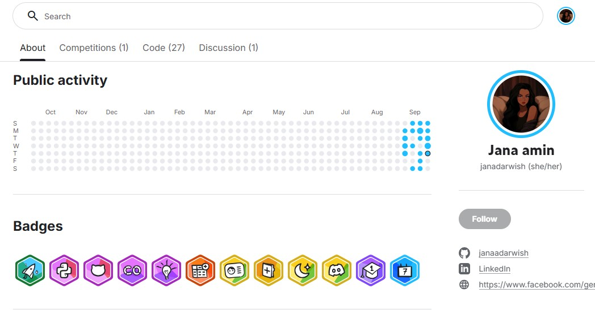

<h2>This is <a href="https://github.com/janaadarwish">Jana Darwish</a></h2>

💻 Computer Science Student @ Helwan University | 💡 **AI & Machine Learning Enthusiast**
🚀 Passionate about turning data into insights and building smart solutions — **one model at a time.**  

🔭 **Currently Working On:**  
- Machine learning projects (Heart Disease Prediction, House Price Prediction)  
- Growing my Kaggle profile & sharpening my data science skills  
- Practicing JavaScript and solving LeetCode problems  

  
  
  
  
  
  

<h2>🌱 ** License & Certifications**</h2>
<ul>
  <li>🎓 <strong>Kaggle</strong> – Intro to Programming</li>
  <li>🤖 <strong>Kaggle</strong> – Intro to Machine Learning</li>
  <li>🤖 <strong>NTI</strong> – Machine Learning</li>
  <li>🧠 <strong>NVIDIA</strong> – Getting Started with Deep Learning</li>
  <li>🌐 <strong>IEEE</strong> – Front-End Development Course</li>
  <li>📊 <strong>SprintXmicrosoft</strong> – AI & ML Fundamentals</li>
</ul>
 

<h2 align="center">📊 Kaggle </h2>
<h5 align="center">this is <a href="//www.kaggle.com/janaadarwish"> Jana Amin </a> an active Kaggle learner exploring Machine learning, data analysis, and model building. I use Kaggle to experiment with real-world datasets, practice feature engineering, and share my progress through notebooks. Currently focused on **classification problems** (like heart disease prediction) and **regression tasks** (like house price prediction).</h6>

 

  

---
